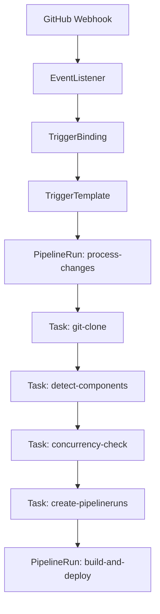

# Tekton CI/CD Solution

## Prerequisites

- kubectl
- kind (or minikube)  
- pack CLI (Paketo buildpacks)
- tkn CLI (Tekton CLI)

## Architecture



## Phase 0: Local Environment Setup (Low RAM Systems - 8GB)

```bash
# WARNING: For 8GB RAM systems, skip concurrency-limit.yaml initially
# or use smaller builders: paketobuildpacks/builder-jammy:tiny

kind create cluster --config kind-config.yaml

# Install Tekton Pipelines
kubectl apply -f https://storage.googleapis.com/tekton-releases/pipeline/latest/release.yaml
kubectl apply -f https://storage.googleapis.com/tekton-releases/triggers/latest/release.yaml
kubectl apply -f https://storage.googleapis.com/tekton-releases/triggers/latest/interceptors.yaml

kubectl apply -f k8s/local-registry.yaml
kubectl create secret docker-registry registry-secret \
  --docker-server=registry.local:5000 \
  --dry-run=client -o yaml > k8s/registry-secret.yaml
kubectl apply -f k8s/registry-secret.yaml

# Skip concurrency-limit.yaml on low-RAM systems (<16GB)
# kubectl apply -f k8s/concurrency-limit.yaml
kubectl apply -f k8s/triggers-rbac.yaml
```

## Phase 2-3: Apply Tasks and Pipeline (with error handling)

```bash
# Apply Tasks using kustomization.yaml 
kubectl apply -k .

# Apply Tasks (manual version if preferred)
kubectl apply -f tekton/tasks/git-clone.yaml
kubectl apply -f tekton/tasks/buildpacks-creator.yaml
kubectl apply -f tekton/tasks/patch-deployment.yaml
kubectl apply -f tekton/tasks/detect-components.yaml
kubectl apply -f tekton/tasks/create-pipelineruns.yaml
kubectl apply -f tekton/tasks/concurrency-check.yaml

# Apply Pipelines
kubectl apply -f tekton/pipelines/build-and-deploy.yaml
kubectl apply -f tekton/pipelines/process-changes.yaml

# Create test deployment
kubectl apply -f k8s/nodejs-npm-deployment.yaml

# Run test PipelineRun
kubectl apply -f tekton/pipelineruns/test-npm-component.yaml

# Watch execution
tkn pipelinerun list
kubectl get pipelinerun -w
```

## Phase 4-5: Component Detection & Concurrency

The `detect-components` task identifies modified buildpack-ready components by:
1. Using `git diff --name-only` to list changed files
2. Extracting top-level directories (component paths)
3. Filtering out non-component directories (scripts, tests, etc.)
4. Returning "no-op" if no buildpack-ready components changed

Concurrency control uses:
- **LimitRange** (optional): Skip on <16GB RAM systems, increase limits on higher-RAM systems
- **concurrency-check task**: Waits if 2+ builds are already running (uses resources: 1Gi limit)

## Phase 6: Expose EventListener

```bash
# Option 1: Local testing with port-forward
kubectl port-forward svc/el-github-listener 8080:8080 -n tekton-pipelines

# Option 2: External via smee.io (recommended)
npx smee --url https://smee.io/your-url --target http://localhost:8080

# Option 3: External via ngrok
ngrok http 8080
```

## Phase 6-7: Configure GitHub Webhook

```bash
# Edit webhook secret
kubectl edit secret github-webhook-secret -n tekton-pipelines
```

In your fork's GitHub settings:
- **Payload URL**: Your exposed URL (e.g., https://smee.io/your-url)
- **Secret**: Same value as `secretToken` in the secret
- **Content type**: application/json
- **Events**: Just push

## Verify Everything Works

```bash
# Check Tekton pods
kubectl get pods -n tekton-pipelines

# Test component detection locally
./scripts/test-detect.sh /tmp/samples HEAD~1 HEAD

# Watch pipeline runs
tkn pipelinerun list --watch
kubectl get pipelineruns
```