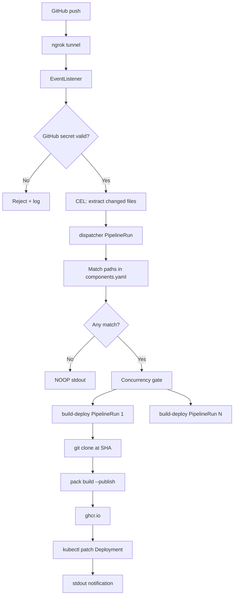

# Architecture

## Overview

Push events from GitHub trigger a Tekton EventListener. After webhook secret validation, a **dispatcher** PipelineRun detects changed components and creates one **build-deploy** PipelineRun per component, with concurrency control.

## Flow



## Components

### `components.yaml`

Single source of truth mapping repo paths to buildpack metadata:

- `path` — directory prefix for change detection
- `buildpack` / `builder` — Paketo configuration
- `build_env` — optional pack `--env` flags
- `port` — application port for Deployments

### Provision scripts

Idempotent bash scripts under `cicd/scripts/steps/`:

1. Preflight tool checks
2. Minikube start/verify (8GB RAM, 4 CPU)
3. Tekton Pipelines + Triggers install
4. Namespace, RBAC, ResourceQuota, ConfigMap
5. Secrets from env (never committed)
6. Generated Deployments + Services
7. Tekton Tasks/Pipelines/Triggers
8. ngrok tunnel to EventListener

### Tekton Tasks

| Task | Purpose |
|------|---------|
| `git-clone` | Clone repo at exact commit SHA |
| `pack-build-push` | Build with Paketo via `pack --publish` |
| `kubectl-patch` | Patch Deployment image + rollout wait |
| `notify` | Structured stdout notification |
| `detect-and-dispatch` | Fan-out with concurrency control |

### Concurrency control

When many components change in one push:

1. `MAX_CONCURRENT_BUILDS` in ConfigMap (default 2)
2. Dispatcher polls running `build-deploy-component` PipelineRuns
3. Waits until count drops below limit before creating next run
4. Namespace `ResourceQuota` caps total CPU/memory

### Security

| Secret | Storage | Usage |
|--------|---------|-------|
| `GITHUB_WEBHOOK_SECRET` | K8s Secret | Tekton GitHub interceptor |
| `GHCR_TOKEN` | K8s docker-registry Secret | pack push + image pull |

Values loaded from `cicd/secrets.env` at provision time only.

### RBAC

| ServiceAccount | Permissions |
|----------------|-------------|
| `pipeline-sa` | Patch Deployments, read pod logs |
| `dispatcher-sa` | Create PipelineRuns, read ConfigMap |

No cluster-admin bindings.

## Image naming

```
ghcr.io/<GITHUB_USER>/<component-id>:<7-char-sha>
```

Example: `ghcr.io/johndoe/go-no-imports:a1b2c3d`

## Error handling

- Invalid webhook secret: rejected by GitHub interceptor before pipeline starts
- No matching components: dispatcher logs `NOOP` and exits 0
- Build failure: PipelineRun marked failed; `notify` task in `finally` prints status
- Rollout failure: `kubectl-patch` dumps pod logs and exits non-zero

## Design decisions

| Decision | Rationale |
|----------|-----------|
| GHCR over local registry | User choice; works with fork PR review |
| ngrok for webhook | GitHub cannot reach localhost |
| Dispatcher pattern | One PipelineRun per component (task requirement) |
| Pre-created Deployments | Deploy via `kubectl patch` (task requirement) |
| `pack --publish` | No Docker daemon required in cluster |
